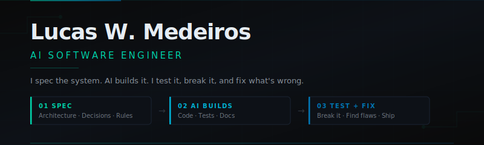

<p align="center">
  
</p>

<br/>

<p align="center">
  <a href="#"></a>
  <a href="#"></a>
  <a href="#"></a>
</p>

---

### `> whoami`

Engenheiro de Software com IA. Não escrevo código — **projeto, direciono e valido**.

Cada repositório aqui segue o mesmo processo:

```
1. EU defino a arquitetura, os requisitos de segurança e as decisões técnicas
2. A IA gera o código baseado nas minhas especificações
3. EU reviso cada linha — segurança, performance, edge cases, qualidade
4. O README documenta TUDO: decisões, aprovações, falhas encontradas, correções
```

> *"O futuro não pertence a quem digita mais rápido. Pertence a quem sabe o que pedir, por que pedir, e quando dizer não."*

---

### `> methodology`

Cada projeto neste perfil é um **case study real** documentado com transparência total:

| Fase | Responsável | Output |
|:-----|:-----------|:-------|
| 🏗️ **Arquitetura & Design** | `Lucas` | Decisões técnicas, diagramas, requisitos |
| ⚡ **Code Generation** | `AI (Claude)` | Implementação seguindo specs |
| 🔍 **Code Review & Validation** | `Lucas` | Security audit, edge cases, aprovação |
| 📊 **Métricas de Qualidade** | `Ambos` | Cobertura, vulnerabilidades, score final |

**O que você encontra em cada README:**
- ✅ Decisões arquiteturais e seus *porquês*
- ✅ O que aprovei de primeira
- ✅ O que mandei refazer e por qual motivo
- ✅ Falhas de segurança encontradas na revisão
- ✅ Métricas reais: cobertura de testes, vulnerabilidades, complexidade

---

### `> projects`

<table>
  <tr>
    <td width="50%" valign="top">
      <h3>🔐 Auth API</h3>
      <p><em>Em desenvolvimento</em></p>
      <p>API de autenticação com JWT, refresh tokens, rate limiting e proteção contra ataques comuns. Foco em segurança real, não tutorial.</p>
      <p>
        
        
      </p>
    </td>
    <td width="50%" valign="top">
      <h3>📊 Em breve</h3>
      <p><em>Próximo projeto</em></p>
      <p>Cada novo projeto será documentado com o mesmo rigor. Arquitetura primeiro, código depois, validação sempre.</p>
      <p>
        
        
      </p>
    </td>
  </tr>
</table>

---

### `> stack`

```yaml
Engineering:
  architecture:  [System Design, API Design, Database Modeling]
  security:      [OWASP Top 10, Auth Patterns, Input Validation]
  principles:    [SOLID, Clean Architecture, DDD]

AI Tooling:
  primary:       Claude (Anthropic)
  workflow:      Spec → Generate → Review → Iterate → Approve

Validation:
  review:        [Security Audit, Edge Cases, Performance]
  quality:       [Test Coverage, Static Analysis, Dependency Scan]
```

---

### `> metrics`

> *Este painel será atualizado conforme projetos forem concluídos.*

```
┌─────────────────────────────────────────────────────┐
│  ENGINEERING METRICS                                │
│                                                     │
│  Projects Completed ........... 0                   │
│  Decisions Documented ......... 0                   │
│  AI Generations Rejected ...... 0                   │
│  Security Issues Caught ....... 0                   │
│  Lines Reviewed ............... 0                   │
│                                                     │
│  ████████████████████░░░░░░░░░░  Building...       │
└─────────────────────────────────────────────────────┘
```

---

### `> philosophy`

```
Não tenho medo de dizer que a IA escreve meu código.
Tenho orgulho de dizer que nenhuma linha vai pra produção sem minha aprovação.

O programador do futuro não é quem digita — é quem PENSA.
Arquitetura. Segurança. Validação. Decisão.

Isso é engenharia.
```

---

<p align="center">
  <a href="https://linkedin.com/in/"></a>
</p>

<p align="center">
  <sub>Cada commit aqui é uma decisão de engenharia documentada. Não um atalho.</sub>
</p>
